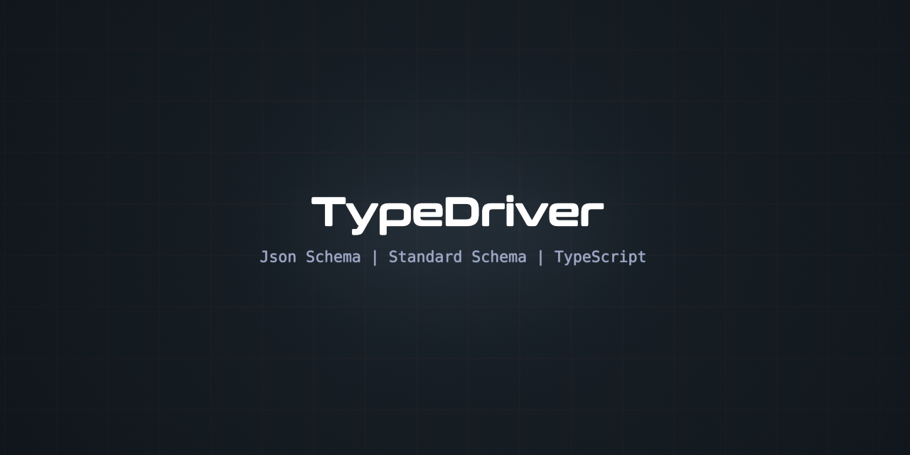

<div align='center'>

<h1>TypeDriver</h1>

<p>A High Performance Driver for Runtime Type System Integration</p>



<br />
<br />

[](https://badge.fury.io/js/typedriver)
[](https://www.npmjs.com/package/typedriver)
[](https://opensource.org/licenses/MIT) [](https://github.com/sinclairzx81/typedriver/actions/workflows/build.yml)

</div>

## Install

```bash
$ npm install typedriver
```

## Example

Multi-Library Type Compiler and Inference System for High Performance Frameworks

```typescript
import compile from 'typedriver'

const Vector3 = compile(`{
  x: number,
  y: number,
  z: number
}`)

declare const value: unknown

const position = Vector3.parse(value)            // const position: {
                                                 //   x: number,
                                                 //   y: number,
                                                 //   z: number
                                                 // } = ...
```

Compiles: [TypeScript](https://www.typescriptlang.org/play/?target=99&module=7#code/PTAEFpK6dv4YpAoEoAqBPADgUwMoDGATgJbYAuqYStd9D4ypAttgPbEWgDeoh7NqQA2uUAF9QAM2KDQAcgo5cAEzIA3XMXnJkAgHYBnbgDVchCpwDMoALz9B2EbgAUAAx7JQoAB4AuUH0AVxYAIy0AGi9QTADgsMjogC84kPDiZHE3AEpdFXNhAENiMQNjUHVC4SDcAKD9AGt9dgB3fV0y7g5DUgpSdn07UDMLawA6bGLDV0rq3GzvRaXFtE7Qbt7+-QDPZb39g8OjpbRvf0C0xOPrm5vTmNSE4ijb17eTsG8Ui6fo9--rmhJPYxqCgA) | [JSON Schema](https://www.typescriptlang.org/play/?target=99&module=7#code/PTAEFpK6dv4YpAoEoBSBnA9gO1AMoDGAFgKYC2AhqmEvQ40+MgJYUAO2ATgC6gBvUEWydWAGzKgAvqABm3UaADkvAJ4cyAE26sAbmW7LkyEbkz8AamSK8eAZlABeYaI4SyACgHJQodZoAXCrYAEYAVja8ygA0vqDcZACOAK6siVrBANrKAB6xKmoFygBeygC6cX4cipp8rGSYwT5+frnN-hpkwcq4KRShhsoyVa1qHQHdKn0DQyPxfiUTXT0zg0Yy8dLI0gCUJlo24lSJrub8elTiKVMpuADWuNgA7rgmZhagXJisvKx4zlA1lsDgAdBwTpgvJdrmRdq0EYi0B9+N9fv9cM0Foicbi8fiCaA0G1gmtDKNCZSqYTiaBxqAydwKdSWayiWBFqT+utsWy+QS0LIXKCRUA) | [TypeBox](https://www.typescriptlang.org/play/?target=99&module=7#code/PTAEFpK6dv4YpAoEoBSBnA9gO1AMoDGAFgKYC2AhgFygAqAngA5kBC2AHqmEn-wMHhkASwrNsAJwAuoAN6gi2cSIA2ZUAF9QAM0nLQAcmksyAE0kiAbmUmHR4qbKatd+ikZOsARl0OgA5GQlXExZADUyImkpAGZQAF5FZWY1MgAKFzIAOgB5bwArKOl0uWQAzjos7IA5AFcKb1t0gEoAGnLQRirTWoamyVaOgIAvHtY+xuaW5E0WmeQzKNUqSQ0QsNArKlU6sjo63ABrXGwAd1wgjdkJTBFpETxE0EjouOzmVcwM7d2yFoCgKBgLQ11At3uj1wdDKwLh8IRiKRQLQFTouH6tmGyJxuJxqK66MxkmxeLJ5ICBLGoAxU0knQpjPxYG0SWy7KAA) | [Effect](https://www.typescriptlang.org/play/?target=99&module=7#code/PTAEFpK6dv4YpAoEoDKAXAhgOwCbYBO+GAxgBYCmAttgFygCiAZi1WZqmEr3-wPDIAljQAOAeyKZQAb1BkJ44QBsqoAL6gWRJaADkmAJ5iq+IsIBuVIvpHipM+ekq1sm7bpoGqbDpjtkRVwAZxkANX8pAGZQAF4FJTFVKgAKF2o6ADowvEISDLdwgEZ012ysIgBXTlTZZFBQAA9GQuyAOSqaACMbABoG0CNW8uwszp7+wYAvEcyxid6iZA0ASnXkZHwOFWJ1YLDQS2wVKqpGKtwAa1wJAHdcTYOZSRDhTGEJXHjQSM4YrJiYghNLHU5UVaNKHQqFoZ6gV7vT64Rj1GHojGYrHY6FoRpEKjYfBfFRGZqMXBdJYDHG0ul0vGgAlEklk4agSmTIg0+m8vmwsD4wnE3Ck0CzDlUmyDfmy2loLQJLLKoA) | [Zod](https://www.typescriptlang.org/play/?target=99&module=7#code/PTAEFpK6dv4YpAoEoDKAXAhgOwCbYBO+GAxgBYCmAttgFygBaA9vqmEl9z7+MgEsaABxZFMoAN6gyLEQIA2VUAF9QAMyJzQAckwBPYVXxEBANypEdyQSLESAVKGwBnUAC8NWmrvdtryLK4LhIAalRkmGIAzKAAvDJywopUABTuAHQsAEYAVhGYqZLIoKAAHoyZuACuNNmWqQCUADQloPqVGTV1DS1t7p3d9URNyCqNjTb4EQrEykEhoGbYCtVUjNW4ANa4LADuuDYLEqIuApgCLLjxoOGRMRnCxC5py6tUjaVf319ox6Cnc6XXCMYo-cEQyFQ6HfNClCqgIaWVow1FotFw9qMJFEFHo-EE35gUoDRG1YZtQlU1FoNQJDIMoA) | [ArkType](https://www.typescriptlang.org/play/?target=99&module=7#code/PTAEFpK6dv4YpAoEoDKAXAhgOwCbYBO+GAxgBYCmAttgFygCCRA1gCoCeADlamEkFDhI8MgCWNbgHsimUAG9QZaVPEAbKqAC+oAGZFVoAOSYeVfEXEA3KkWPIJU2fKVneO-YZonird1QOyCq4AM7yAGpUZJiyAMygALzKqtwaVAAUARkKyKCgAB6MxrgArjQARnbGADR5oJzFZZXVdfkAXk3lVfbI2gCU-Y740erEWiHhoNbY6qVUjKW4rLjSAO64jpPyMqHimOLSuEmgUTHxAHTcxKGZM3NU-fnPL89o26C7+4e4jLmvAMBQOBIJeaHyRVAzR6bVBcPhcPBDUY0LssIRGMx+SRnSh3Ts9SxRMRYF0yQuFKAA) | [Valibot](https://www.typescriptlang.org/play/?target=99&module=7#code/PTAEFpK6dv4YpAoEoDKAXAhgOwCbYBO+GAxgBYCmAttgFygBq2ANgJYBGA9pqmEkFDhI8MnY0ADtyKZQAb1BluU9qyqgAvqABmRFaADkmAJ6Sq+IuwBuVIoeTipMuQCpQ2AM6hru-TSNrNi5eB2RlXE85JioyTBkAZlAAXiUVSTUqAAprADpuTgArWMws+WRQUAAPRjzcAFcaTjssgEoAGgrQE1rchqaWjq6AL17+5qI25E1W1sd8WNZiDQionzZ6qkZ63ABrXG4Ad1xHVblpT3ZMdm5cFOYSxNzJYk9soNZN1sqf35+0M6gC5XG64RjlP6QqHQmGw35oSo1UDjOydOHojEYhHdRgoohozGEon-MCVUbIxoTLrEmnotDaVK5JlAA) | [Arri](https://www.typescriptlang.org/play/?target=99&module=7#code/PTAEFpK6dv4YpAoEoDKAXAhgOwCbYBO+GAxgBYCmAttgFygCCRRAlqmEtz73+MjY0ADgHsimUAG9QZUSLYAbKqAC+oAGZF5oAOSYAnsKr52ANypFdgkeMkzsazdpp6AAsXZFhZYAGdKWmxrZDlcP0kANSoyTHEAZlAAXll5YSUqAApsADpRACMAKxjMTKlkUFAAD0Zc3ABXGnzLTIBKABoK0ANanIamlo6ugC9e-uaiNuRVVtbkZHwYxWIVMIjQM2xFeqpGetwAa1xRAHdcebXJMT82TDZRXGTQaNiEnOFiPyzN7apWyoBgIBaEuoGut3uuEY5SBsLh8IRiMBaEqNVA40snSR2JxOJR3UYGKIWNxpLJwLAlVG6MaEy65IZ2LQ6hSOTZQA) | [Sury](https://www.typescriptlang.org/play/?target=99&module=7#code/PTAEFpK6dv4YpAoEoDKAXAhgOwCbYBO+GAxgBYCmAttgFwYCuRAnqmEl9z7+MgEsaABwD2RTKADeoMqJECANlVABfUADMi80AHJMrYVXxEBANypFdgkeMkAqUNgDOGTdpp7nLVrtD+AwKDg-zQAFgA6AGZQAGsAIVAAChoBXFAAalAAcwAvAWEASmRkOVxnSQA1KjJMcRiAXll5YSUqJPQI50pabCSpZH8AD0ZO3CYaACNLABpB0FZRiPGp2fncpZXpojnVQuLkfBrFYhUyitAzbEUmKkYmXFjcUQB3XBLzyTFnAUwBUXSTWqtXqEWExGc7SuNyohRCQTQn1A31+-1wjAG8Kx2JxOLQw0YWzWuJJpOx+IWhIm2zmZLp9NAFI2oCJRHmDI55LA6iaET5QA) ... and more

## Overview

TypeDriver is a validation compiler and type-inference middleware designed to integrate JSON Schema and Standard Schema compliant validation into framework interfaces such as HTTP routes and RPC endpoints. It also functions as a validation optimizer built to accelerate high-throughput messaging systems.

This project is designed to unify heterogeneous runtime schema systems based on JSON Schema and Standard Schema into a single system that preserves static type inference, runtime validation, and schema reflection, while remaining compatible with multiple schema ecosystems.

License MIT

## Contents

- [Overview](#Overview)
- [Features](#Features)
- [Framework](#Framework)
- [Compile](#Compile)
- [Check](#Check)
- [Parse](#Parse)
- [Errors](#Errors)
- [Locales](#Locales)
- [Static](#Static)
- [Script](#Script)
- [Reflect](#Schema)
- [Extensions](#Extensions)
- [Accelerate](#Accelerate)
- [Compression](#Compression)
- [Contribute](#Contribute)

## Features

Framework Integration

  - Designed specifically for [type-safe](#Framework) I/O interfaces.
  - One function to [compile](#compile) schematics into Validators.
  - One type to [infer](#Static) schematics into TypeScript types.
  - Schema [extension](#Extensions) model for Framework specific runtime type API

Schema Support

  - TypeScript [DSL](#Script) for TS7-native (supported in TS5+).
  - Scalable JSON Schema type inference ([demo](https://tsplay.dev/wjrYMw))
  - Supports JSON Schema Drafts 3 through 2020-12.
  - Full support for Standard Schema

Validation Compiler

  - High-performance JIT compiler for faster application start up.
  - High-performance runtime validation (approx 2x Ajv performance)
  - Automatic [acceleration](#Accelerate) for libraries supporting Standard JSON Schema.
  - Automatic JIT fallback for [content-security](https://developer.mozilla.org/en-US/docs/Web/HTTP/Guides/CSP) restrictive environments (Cloudflare)

Tooling and Interoperability

- JSON Schema [reflect](#Reflect) API for OpenAPI, MCP, and IDL-Based Systems
- Error [formats](#Errors) for JSON Schema and Standard Schema Based Systems
- Includes [localized](#Locales) error messages (i18n) as standard.

## Framework

TypeDriver is designed for framework integration. It provides a simple infrastructure to connect type inference and validation to framework interfaces.

Ref: [TypeScript](https://www.typescriptlang.org/play/?target=99&module=7#code/PTAEFpK6dv4YyAoEoAiBTAzgSwOYB2qYSZ5FcyADgPbYAuAFAOTAsA0oA3sqKACNaAEwCeALlAADXv34APSYQCuAWwGYAThz5yJoFeq065oAF5K1GzboC+U5La5NNmAI7KcDAJSgAvAB8PLoAxrSEjDyg8lyiXGagtv6grh5eAHRCYqBoDKLUmODYAIYAZpgAhI7eyCQQlA2N8HUAYprFqpgA7rSaANZ1TUPDyLiqdJoMUXkFoADKDMUMuCFcYeO4ADaYiaClmrSqoCwzmMKauABuWiy1mPITU7iEDFqlxSE7AEq0yq8A8tRluFsAAeABCIlEoHur0IwmwoGUhD6hFoXUIyWRqPRhCCskEUMkkLEjmQ90eoFOoB+f0wAGFiptNgIPn1QQAFJYACxh8jhCNAjAuhHwXEBwIifIFiNpAKBuBBQT8oCYuhc7k8jEk3CRmk2ki5DG5XCy+gWSxWoIlioiAG0WGaWABdIK2XyBUCXWi4YTIGoU3pTUrIkKS0B0RicnnSzDwxHC55i0BhCJTG0g2Pxmm-eWS7BcXSM5mskJ9ZJyhlMlls6PG8UKpXIAJMag8w08ri0RsRSQZiJraulvqSYs1su+AmpyJmgD6lyZvqWvWS62oW0wTG7+YdTudNX4uREtEk6TPoDG1G2nReKVzO02tHwKzJQA) | [JSON Schema](https://www.typescriptlang.org/play/?target=99&module=7#code/PTAEFpK6dv4YyAoEoAiBTAzgSwOYB2qYSZ5FcyADgPbYAuAFAOTAsA0oA3sqKACNaAEwCeALh59+oBqOqZJLWgIBWmAMYNO0-gCdMARwCuuA8MkBtFgA9OoFqPssAXiwC6HXaGp7aCvQZcHEleGRkbUNl5RQdCYwBbAUw9FlAAXy9w-gkeaIUleKSUtMzvfhcouQK4xOTUjKyZdOkWzNAmAxMcBgBKUABeAD4pfg1aQkY8my5RLhcMwdAu4x6AOiExUDRqzHBsAEMAM0wAQmR03uQSCEo7+-gbgDE9A4TMAHdaPQBrG4eAYDkLgEnRAnldqAAMoMA5BDRccag3AAG0wiyOfgSDl2wj0uAAbiVrpgbGCGKBcIQGCkjgcNOiAEq0Yw0gDy1CCE2wAB4AEIiUSgUk0wjCbCgYyEH6EWgfQhLKUyuWEEZhQSCyQCsQXZCk8n5JksmkAYQOKJRAnpPx5AAU4QALYU2UXi0CMfGEfBcDlcybO10S5mszC+3DckYDDrSTpGVaMKLGPQoyT2hgOribXIwuG4DQ8sPc6xZjwjS6DEYE2i4YTIK7674Uo5SrThhV0Rh2x0BzBiiUeqne0DjSYUwv+kW9t3B9mctvYLjSM0Wq0aH5LGeYZeW61d9M+ucR5BDJjUR2px1cfx+7CSccL4fmndryTb1c-frqkdTLMAfQJ5o1nC3xLEi1CopgTDXvOxaCh4Vz8DsIi0JIaxoZSoJou81LLMa6IorQ+B5rqQA) | [Standard Schema](https://www.typescriptlang.org/play/?target=99&module=7#code/PTAEFpK6dv4YyAoEoAiBTAzgSwOYB2qYSZ5FcyuAtgA4D2ATgC6gBUoAhtqAF6gAZkwY1QAcj4MAJuOTJG2FgApxwcQBpQAb2ShQAIxkBPAFz8AdAwMArTAGMVu-foAe5vhcIBXGgcxMygCUGnouZpY+fgHBoS78Hl6+-oEhYQC+QcjpWspMmACO3jgsQaAAvAB8OmH2DIRKOqCuWsZaAukVoPlFJRZG0sagaCzGdJjg2FyCmACE2VkkEJQrq-BLAGJMXDSYAO7MANZLa6dn1PTMbNqgo+OgAMosXCy49lp19LgANpigncJRBI7phpExcAA3AJyZCYVyMVigXCEFgBQRcex-ABKDG8qIA8nRXvVsAAeABCJlAcNRhGkvG8hEOhAYe0IXUZzNZhGqzkMJnMlMG2Vh8KutzG2NxqIAwlxvt8DBjDqSAAovAAW1NctPpoCU4MI+C0hOJDW1ut4OLxmFNuBJ1XKoGUYTyhWKSnMN28TG+5nVLA1WgGESeLzepLtJIA2uIQ+IALrVTIVaoQhi4aTILJwhFsQSMxz29mKFhqzUWzB03gG5HG0B1BpsKPmmlVvXWglE4vYLRhOUKpX2Q5dTuYAeK5XlwMm7sO5CVZR0TX+zVaBhzhrmFu9hvyyfD8wToeHMp8xuNEMAfQh8szL2YXU+dB+mGUG7N2Fj8YTWX0IxkBhzAsECkXoX5dhRbppT+b4GHwN4RSAA)

```typescript
// Next Generation Inference System Based on TypeScript DSL (TS7)

route('/', {
  body: `{
    x: number,
    y: number,
    z: number
  }`
}, (request) => {
  const { x, y, z } = request.body // type-safe!
})
```

The above interface design is achieved with the following TypeScript definitions 

<details>

<summary>Route Interface Definition (Expand)</summary>


```typescript
import { type Static, compile } from 'typedriver'

export interface RouteOptions<Body extends unknown = unknown> {
  body: Body
}
export type RouteCallback<Path extends string, Options extends RouteOptions> = (
  (request: { url: Path, body: Static<Options['body']> }) => void
)
export function route<Path extends string, const Options extends RouteOptions, 
  Callback = RouteCallback<Path, Options>
>(path: Path, options: Options, callback: Callback) {
  const body_validator = compile(options['body'])
  // todo: ... implement route logic
}
```

</details>

## Compile

TypeDriver consists of a single compile(...) function that accepts JSON Schema, Standard Schema or TypeScript definition and returns a Validator instance.

```typescript
import compile from 'typedriver'
```

 Ref: [TypeScript](https://www.typescriptlang.org/play/?#code/JYWwDg9gTgLgBAbzgYwuYAbApnAvnAMyjTgHIYBPMLAEymADcspSAoV1AOwGd4A1LMhjQAzHAC8KNGExYAFAAMErOHAAeALjicAriABGzFXApbdBo6oBeZvYaitcCgJSq37j56-ef7gPR+Ujz8gsJQIlp8AIYYwDRRYQA8AHSpADSIxr7ZObluAW6a2nbMaVl5FZX5gaqmxRZQZVXNlQXWtg1NLd3ZBbgAfOxcvHCQ3MAwwBCcEnACQqLJYFFQ3PJIxkUADF11AIxdNnBbjs5AA)

```typescript
const Vector3 = compile(`{
  x: number
  y: number
  z: number
}`)
```

 Ref: [JSON Schema](https://www.typescriptlang.org/play/?#code/JYWwDg9gTgLgBAbzgYwuYAbApnAvnAMyjTgHIYBPMLAEymADcspSAoV1AOwGd4A1LMhjQAzHAC8KNGExYAFEjhLlK1WtUB6DVJ79BwqCIBccPgEMMwGmYMAeAHSOANIlZLK1E6QgAjAFb6pC7qIaFhWsoAHiacAK4gPsxObnBQWACOscBpNCYA2qSRQWQUxaQAXqQAusFhdXARShQx8YlQyUpgxNSwwFjcJor1w+HaSuUtCcwpStGIcB5YXnFTLHi1I6ERuAB8M3DN84vLrcyk6-sTR1RLZCtt57gpT7gAlOxcvHCQ3MAwwBBOBJTPpRPYwGYoNx5EgUnMAAwdA4mACMSKu8NYbyAA)

```typescript
const Vector3 = compile({ 
  type: 'object',
  required: ['x', 'y', 'z'],
  properties: {
    x: { type: 'number' },
    y: { type: 'number' },
    z: { type: 'number' }
  }
})
```

 Ref: [Standard Schema](https://www.typescriptlang.org/play/?#code/JYWwDg9gTgLgBAbzgYwuYAbApnAvnAMyjTgHIYBPMLAEymADcspSAoV0SWOAKjgEMAznABehYiDIiINNq1QA7QfABqWZDGgBmOAF4UaMJiwAKEQDoIAIwBW6mCaRxnL12+cB6DwaWr72gC44FX4MYBp+TSgAHnM4gBpEVmcADyCLBQBXECtmEwBKRPdiktK3Lxc0uCyc5njkuAp08xrcqAKisq7uuArnJurstvrnEWbWvMKe6dK+0SCJqFZcfPyZ9Y3e71wAPnZFZThIQWAYYAgFPWD-KC1zMH4oQVMkBqqABhHGoIBGL7G4O9lvkgA)

```typescript
import * as z from 'zod'

const Vector3 = compile(z.object({ 
  x: z.number(),  
  y: z.number(), 
  z: z.number(), 
}))
```


## Validator

The compile(...) function returns Validator instances to Check, Parse and report Errors for JavaScript values.

## Check

The check(...) returns a boolean result.

```typescript
// Vector3.check(value: unknown): value is Vector3

if(Vector3.check(value)) {

  const { x, y, z } = value // safe
}
```

## Parse

The parse(...) function returns if valid, otherwise throws.

```typescript
// Vector3.parse(value: unknown): Vector3

const { x, y, z } = Vector3.parse(value)                 
```

## Errors

The errors(...) function returns error diagnostics for values (use after failed check only)

```typescript
// Vector3.errors(value: unknown): TLocalizedValidationError[]

const errors = Vector3.errors(value)              
```

The errors(...) function can generate both JSON Schema and Standard Schema error formats.

```typescript
const errors = Vector3.errors({ x: 1, y: true }, {  
  format: 'json-schema'                             
})

const issues = Vector3.errors({ x: 1, y: true }, {  
  format: 'standard-schema'                         
})
```

<details>

<summary>Generated Errors and Issues</summary>

```typescript
// TLocalizedValidationError[]

const errors = [{    
  keyword: "required",    
  schemaPath: "#",
  instancePath: "",
  params: { requiredProperties: [ "z" ] },
  message: "must have required properties z"
},
{
  keyword: "type",
  schemaPath: "#/properties/y",
  instancePath: "/y",
  params: { type: "number" },
  message: "must be number"
}]

// StandardSchemaV1.Issue[]

const issues = [
  { path: [], message: "must have required properties z" },
  { path: [ "y" ], message: "must be number" }
]
```
</details>

## Locales

TypeDriver provides localized translations for multiple languages and locales, using BCP 47-compliant locale identifiers expressed with underscores (_) in place of hyphens (-). These can be passed to the errors(...) function in the following way.

```typescript
const issues = Vector3.errors({ x: 1, y: true }, {  
  format: 'standard-schema',                        
  locale: 'ko_KR'                                   
})                                                 
```

<details>

<summary>Generated Localization</summary>

```typescript

// StandardSchemaV1.Issue[]

const issues = [
  { path: [], message: "필수 속성 z을(를) 가지고 있어야 합니다" },
  { path: [ "y" ], message: "number이어야 합니다" }
]
```
</details>

<details>

<summary>Supported Locales</summary>

```typescript
type LocaleString = (
  | "ar_001" | "bn_BD"   | "cs_CZ"   | "de_DE"  | "el_GR"  | "en_US" | "es_419" 
  | "es_AR"  | "es_ES"   | "es_MX"   | "fa_IR"  | "fil_PH" | "fr_CA" | "fr_FR" 
  | "ha_NG"  | "hi_IN"   | "hu_HU"   | "id_ID"  | "it_IT"  | "ja_JP" | "ko_KR" 
  | "ms_MY"  | "nl_NL"   | "pl_PL"   | "pt_BR"  | "pt_PT"  | "ro_RO" | "ru_RU" 
  | "sv_SE"  | "sw_TZ"   | "th_TH"   | "tr_TR"  | "uk_UA"  | "ur_PK" | "vi_VN" 
  | "yo_NG"  | "zh_Hans" | "zh_Hant"
)
```
</details>

Localization support is only available for JSON Schema

## Static

TypeDriver provides unified type inference for JSON Schema, Standard Schema and TypeScript | [Reference](https://www.typescriptlang.org/play/?target=99&module=7#code/JYWwDg9gTgLgBAbzjAnmApnAyjAhjYAYzgF84AzKCEOAclQwBMpgA3dKWgKC4Hpe4ACQjsocdLkIALOI3TlgAO2AEIi5BDhKAzhkLwYUzA3Q9+cACpp0WQizAweJuAEE4AXmx4ChADwADJC44OAAPAC44RQBXEAAjDgAaYLgUSJj4pJSAL3TYhKguEn8APjMBACksAHkAOWxpdBBcJ2s4ACEPL3wiXwQUk0jaCDiAK3R9WmSQqHQAR2jgWcZIgG1aUKm6FC3abNoAXWm4MCoMWGB0bUj+kJCIxGRrIYyC2lJjkLTHwbpXjneJE+cFyP2ef3yAI+KRIRTKfAEOFwikYuCgjAaRmaPFAkFgcAAVHBcNoQRQqDQ9hBGNwuM4AMJdJE+XwmCDkOD0sqENTaeCMzzZAB0I3G+gAFLcwpFhf8oOKAJTHb6yyHypU5GVCuWK5IkBVcIA)

```typescript
import { type Static } from 'typedriver'

// TypeScript

type A = Static<`{ 
  x: number,
  y: number,
  z: number
}`>

// JSON Schema

type B = Static<{
  type: 'object',
  required: ['x', 'y', 'z'],
  properties: {
    x: { type: 'number' },
    y: { type: 'number' },
    z: { type: 'number' },
  }
}>

// Standard Schema

import * as z from 'zod'

type C = Static<typeof C>
const C = z.object({
  x: z.number(),
  y: z.number(),
  z: z.number(),
})
```

## Script

The [TypeScript DSL](https://sinclairzx81.github.io/typebox/#/docs/script/overview) is a runtime and type-level emulation of TypeScript. This feature is based on TypeBox's ability to transform TypeScript syntax into JSON Schema. The DSL supports most TypeScript definitions, as well as type-level constraints expressed using JSON Schema keywords.

> ⚠️ The name `Options<T>` is subject to change. Because Options is a commonly used type name, it may not be appropriate for schema constraint augmentation. As a result, Options should be considered an experimental feature. TypeBox and TypeDriver are open to suggestions for a more suitable name for this type.

```typescript
const ClampedVector3 = compile(`{
  x: Options<number, { minimum: 0, maximum: 1 }>,
  y: Options<number, { minimum: 0, maximum: 1 }>,
  z: Options<number, { minimum: 0, maximum: 1 }>
}`)

const JsonSchema = ClampedVector3.toJsonSchema()

// const JsonSchema = {
//   type: "object",
//   required: [ "x", "y", "z" ],
//   properties: {
//     x: { type: "number", minimum: 0, maximum: 1 },
//     y: { type: "number", minimum: 0, maximum: 1 },
//     z: { type: "number", minimum: 0, maximum: 1 }
//   }
// }
```

Refer to [TypeBox](https://github.com/sinclairzx81/typebox) for additional information on this feature.

## Reflect

Validators can reflect back a JSON Schema representation if the underlying type supports it. This is true for all TypeScript and JSON Schema source types. Reflect can be used for OpenAPI metadata publishing, or RPC systems that need to publish JSON based IDL (interface definition language) to remote callers. Validators provide two functions for this.

```typescript
import compile, { type Static } from 'typedriver'

const validator = compile(...)

validator.isJSONSchema()    // Returns true if the validator can be converted to 
                            // JSON Schema. This is true when the validator was 
                            // compiled with JSON Schema or TypeScript, but false 
                            // if it was compiled with Standard Schema.

validator.toJSONSchema()    // Returns the JSON Schema for the validator. If the 
                            // validator was compiled with Standard Schema, an 
                            // empty {} is returned to indicate an unknown 
                            // runtime schema.
```
The original source type used for compilation can also be returned via

```typescript
validator.schema()          // will return the schematic used for compile.
```

## Extensions

TypeDriver enables Frameworks to define custom Runtime Types specific to the Framework. This can be achieved by creating functions that return statically observable JSON Schema. These schematics can be passed to compile(...) and Static and used like any other type.

Ref: [Framework Types](https://www.typescriptlang.org/play/?target=99&module=7#code/JYWwDg9gTgLgBAbzgYwuYAbApgGjjATzCzgGUYBDGYZOAXzgDMo04ByQ4gEymADcsUNgChhAejFwAtDNlz5CxUuUrVU8ZICqAZwoBzLBulqTps2uGoAdtvgA1LMhjQAzHAC8KNGExYAFBAARgBWjjB+CMJwcAAeAFxwVgCuIIGCfgCUOFFwBAnJqelZOQBe+SlpUJnCdBkZopwkDk6uHmSU1MgAPI0QjHDNzlAuAHyiEsbmU9MmRppWwBBWACoQy0lg2Ak6WFz4EHAAojEwUBROcAAKLMSwBADSWATaTCwgVzeC1FjaRjP-AIUwkacHmixWEAAklYYIJtGFwV1NCM2n5NHAsCcsFYuC8KFYCHAAPxwPzxUEZDwovgQYB7fJYARQSmY2E4l5khLAKyMQRwSGU9zU2l7EmQuAMpnAogkAAyFFsAHlGEiUZ4wUtVtDYVB4U5EaCMVj2XB8YSSZyKVS4DS6RLEoy+SjWdjcaTydzeVA4LLBcK7STZfarI6oNLiKCFpq1htsEi8PLbG1EzBlaq1XAANqaAC6RrZbszIaZeZJmbzCUzADoaxqIetNlgusdkBgklwm5oEwqYCMRt3bDnxpJAaPAUYAGJnEBYADu0AA1oqQmE-mP11NwyQAEpYACOSWAUF2AEEoGcCF1rhBbt8Xi6TbvUFAuF1bLwrHo8EkrAurBBZysfscmvW8Hiee9jTdd9uT0NpjlOc4YC6Bcnj6D4by+YAfjwGDP2A6JdwPI9T3PChCXVKN61jJtQK+cDnjGDMiMPY8uDPC9hExSBYDgbkdUYc4SCnCgZ3nKAlxXJwr0+WBsMggsXifaBXzwr84B-P8AKAlFImiRoEjYIJQicNg8ByMBZLvBI6LknC4ByY9iLYhIWJI9iyMvWy7zGOguJiHj4EYH99SWOBjLCLprCTbz5PzV0lMcFS31OWDv1-f9AL7PxLMwuztBsqz5IyBIRLExdlxM5DYp+XTHKwGAkigKxEHwGVDIi0y8Cc1jdgSSqwirVDnhyoqfiyOBctvOKGAVB0pT8iYN2W0xJ2nOdFwAOQqQQ1xW-alGEfjBEE5BhPW8SF22wpvT0triEMgpKhEPzuOgIKQuoMKnqKUqLq2nbboc6Jj0a5rWoM9gfqEegaiAA)

```typescript
import compile, { type Static } from 'typedriver'

interface FrameworkString {
  type: 'string'
}
export function number(): FrameworkString { 
  return { type: 'string' }
}

// ... Usage

const T = number()                     // const T: FrameworkString = { type: 'number' }

type T = Static<typeof T>              // type T = number
```

## Accelerate

TypeDriver provides acceleration support for libraries that implement the upcoming Standard JSON Schema specification. This is a new specification enables remote type libraries to be integrated directly into TypeBox validation infrastructure. This project tracks upstream implementations of this specification and maintains a benchmark measuring compariative performance with and without compile(...).

```bash
$ deno task bench
```
Benchmark 16M Parse Operations of this Structure | We Measure Time To Complete
```typescript
const Vector3 = compile(`{
  x: number,
  y: number,
  z: number
}`)
```

Accelerated Indicates Support for Standard JSON Schema

```bash
┌────────────┬────────────┬─────────────┬──────────────┬──────────────┬─────────────────┐
│ (idx)      │ iterations │ accelerated │ default(...) │ compile(...) │ result          │
├────────────┼────────────┼─────────────┼──────────────┼──────────────┼─────────────────┤
│ typescript │ 16000000   │ true        │ "  ------"   │ "   30 ms"   │ "  ------"      │
│ jsonschema │ 16000000   │ true        │ "  ------"   │ "   29 ms"   │ "  ------"      │
│ arktype    │ 16000000   │ true        │ "  537 ms"   │ "   30 ms"   │ "94.41% faster" │
│ arri       │ 16000000   │ false       │ " 3086 ms"   │ " 3049 ms"   │ "1.20% faster"  │
│ effect     │ 16000000   │ false       │ "24183 ms"   │ "23886 ms"   │ "1.23% faster"  │
│ sury       │ 16000000   │ false       │ "  153 ms"   │ "  166 ms"   │ "8.33% slower"  │
│ valibot    │ 16000000   │ false       │ " 3632 ms"   │ " 3515 ms"   │ "3.21% faster"  │
│ zod        │ 16000000   │ false       │ "  575 ms"   │ "  603 ms"   │ "4.93% slower"  │
└────────────┴────────────┴─────────────┴──────────────┴──────────────┴─────────────────┘

Last Run: Thu Dec 04 2025
```

## Compression

TypeDriver is intended for server-side validation in Node, Deno and Bun runtimes, but can be used in Browsers also. TypeDriver depends on most of TypeBox's internal compiler and TS emulation infrastructure. The following shows the compression metrics for bundled, minified and gzipped. TypeDriver uses esbuild for bundling and Deno local gzipped compression.

```bash
$ deno task metrics
```
Compression Rates
```bash
┌───────┬─────────────────────────┬─────────────┬─────────────┬────────────┐
│ (idx) │ path                    │ bundled     │ minified    │ gzipped    │
├───────┼─────────────────────────┼─────────────┼─────────────┼────────────┤
│     0 │ "./task/metrics/all.ts" │ "579.74 KB" │ "286.01 KB" │ "55.14 KB" │
└───────┴─────────────────────────┴─────────────┴─────────────┴────────────┘
```

## Contribute

TypeDriver is open to community contribution. Please ensure you submit an issue before submitting a pull request. This project prefers open community discussion before accepting new features.
