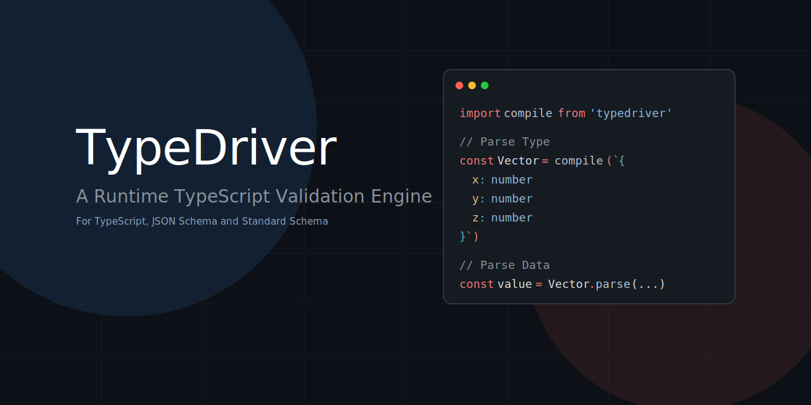

<div align='center'>

<h1>TypeDriver</h1>

<p>A Runtime TypeScript Validation Engine</p>



<br />
<br />

[](https://badge.fury.io/js/typedriver)
[](https://www.npmjs.com/package/typedriver)
[](https://opensource.org/licenses/MIT) [](https://github.com/sinclairzx81/typedriver/actions/workflows/build.yml)

</div>

## Install

```bash
$ npm install typedriver --save
```

## Usage

Compile TypeScript definitions into high performance validators

```typescript
import compile from 'typedriver'

const Vector = compile(`{
  x: number
  y: number
  z: number
}`)

const value = Vector.parse(data)                    // const value: {
                                                    //   x: number,
                                                    //   y: number,
                                                    //   z: number
                                                    // } = ...
```

Syntax highlighting is available via the [Visual Studio Marketplace](https://marketplace.visualstudio.com/items?itemName=sinclairzx81.typebox-script)


## Overview

TypeDriver is a runtime type system that compiles TypeScript, JSON Schema and Standard Schema definitions into high performance JSON Schema validators. It also statically emulates the TypeScript type system inside the TypeScript type system which enables it to infer types from strings.

License MIT

## Contents

- [Compile](#Compile)
- [Validate](#Validate)
- [Script](#Script)
- [Parse](#Translate)
- [Static](#Static)
- [Reflect](#Reflect)
- [Integrate](#Integrate)
- [Benchmark](#Benchmark)
- [Contribute](#Contribute)


## Compile

[TypeScript](https://www.typescriptlang.org/play/?target=99&module=7#code/PTAEFpK6dv4YpAoEoAqBPADgUwMoDGATgJbYAuqYStd9D4ypAttgPbEWgDeoh7NqQA2uUAF9QAM2KDQAcgo5cAEzIA3XMXnJkAgHYBnbgDVchCpwDMoALz9B2EbgAUAAx7JQoAB4AuUH0AVxYAIy0AGi9QTADgsMjogC84kPDiZHE3AEpdFXNhAENiMQNjUHVC4SDcAKD9AGt9dgB3fV0y7g5DUgpSdn07UDMLawA6bGLDV0rq3GzvRaXFtE7Qbt7+-QDPZb39g8OjpbRvf0C0xOPrm5vTmNSE4ijb17eTsG8Ui6fo9--rmhJPYxqCgA) | [JSON Schema](https://www.typescriptlang.org/play/?target=99&module=7#code/PTAEFpK6dv4YpAoEoBSBnA9gO1AMoDGAFgKYC2AhqmEvQ40+MgJYUAO2ATgC6gBvUEWydWAGzKgAvqABm3UaADkvAJ4cyAE26sAbmW7LkyEbkz8AamSK8eAZlABeYaI4SyACgHJQodZoAXCrYAEYAVja8ygA0vqDcZACOAK6siVrBANrKAB6xKmoFygBeygC6cX4cipp8rGSYwT5+frnN-hpkwcq4KRShhsoyVa1qHQHdKn0DQyPxfiUTXT0zg0Yy8dLI0gCUJlo24lSJrub8elTiKVMpuADWuNgA7rgmZhagXJisvKx4zlA1lsDgAdBwTpgvJdrmRdq0EYi0B9+N9fv9cM0Foicbi8fiCaA0G1gmtDKNCZSqYTiaBxqAydwKdSWayiWBFqT+utsWy+QS0LIXKCRUA) | [Standard Schema](https://www.typescriptlang.org/play/?target=99&module=7#code/PTAEFpK6dv4YpAoEoDKAXAhgOwCbYBO+GAxgBYCmAttgFygBaA9vqmEl9z7+MgEsaABxZFMoMixECANlVAAzItNAByTAE9hVfEQEA3KkTXJBIsRIBeSlTXVW2p5FNwBnCQDUqZTGIDMoAC8ktLCclQAFFYAdCwARgBWPpiRAN7IoKAAHoyxuACuNPHGkQCUADSZoJp5MYXFpZXVVnUNJUTlVQC+ZWVm+D6yxAquHqAG2LIFVIwFuADWuCwA7rhmYxKibgKYAiy4waDevgExwsRuUZPTVGVZD48PaJug27v7uIwZT79--wDAY80FlcqB2sYqkDoTCYSCaowIUQobDUWjnmAsq1wUUOtV0QToWhukcYmSgA)

The compile function will accept any TypeScript, JSON Schema or Standard Schema definition and JIT compile it into a high-performance runtime validator. If the JavaScript environment does not support JIT (i.e. Cloudflare), the compiler will automatically fallback to dynamic validation.

```typescript
import compile from 'typedriver'
```

### TypeScript

```typescript
const User = compile(`{
  name: string
}`)
```

### JSON Schema

```typescript
const User = compile({
  type: 'object',
  required: ['name'],
  properties: {
    name: { 
      type: 'string' 
    }
  }
})
```

### Standard Schema

```typescript
const User = compile(z.object({
  name: z.string(),
}))
```


## Validate

TypeDriver validators have three validation functions.


### Parse

Use parse for check-and-return, otherwise throw

```typescript
const { x, y, z } = Vector.parse(data)
```

### Check

Use check for fast boolean result

```typescript
if(Vector.check(data)) {
  const { x, y, z } = data      
}
```

### Errors

Use errors to get diagnostics after a failed check

```typescript
const errors = Vector.errors(data, {
  format: 'standard-schema',                         // (default) 'json-schema'
  locale: 'ko_KR'                                    // (default) 'en_US'
})
console.log(errors)
```

## Script

[Definitions](https://www.typescriptlang.org/play/?target=99&module=7#code/JYWwDg9gTgLgBAbzgYwuYAbApnAvnAMyjTgHIYBPMLAEymADcspSAoV1AOwGd4BBGnSzducALxwABglZw4vKFiwwAXPJj1OAc1kpglNQuDbdqAK6cNFQxuM7ckjhB7wAqt2bipMuZwCGIFg2mjpyWCB+mMF2un6CiiJqACQIAkIiuKwOTi5wAArENGbI8BLSusA00Sa+AUHqIbpg9Mj1nGYgAEbMWY5cvHAA8lA0nmU+cGYeUMkI7syZcs0QRSXcswUrxTC4ANoAur3s-fAMfhiVfjDQXqjo2AAUw6NQAJRyH3IA9F8ozgNnC40K7QNQAFQAaudLtcoAAeCafJHIlGo1E-D5TZhqRFovH4lEYz7+QLVLQAbl0BOp1KJH3CkQwZMpNNZ+Lpcji6XWiCpbP5nw5HwUSlUDTsLIFUu+v2RyH01nF2kl0oFQrk5ksUEVRmVfNVrKFuBVBsNsrwJtNtPNy1WMB5uKtBKFJPquop+qdeKFlWZnq96PNSxabQ63SgloDgY+e32kajyIxuAAfKwgA) |  [Options](https://www.typescriptlang.org/play/?target=99&module=7#code/FASwtgDg9gTgLgAgN4IMZUiANgUwQXwQDMYMEByOATwhwBMYQA3HGc4YdAOwGdEA1HKjiwEAXjQYI2HAAoABkmAIEADwBcCLgFcwAI1YIA7iDgALZAjAgu4XZoAMAGisBDVXbCaAjASfKEKk0dfUMTc0trWzB7BGc3DxivBF98YEJwiyUVOhweVEYIOBAoLk1yACYAEQRBYVEAFRocdnx5AEoObh4oXAA6LCgAc1k6kRg+kQApHq4AZVQzHDBXWXb2lU2t7c2Ael3kAJ3jk9Oz0-3N6lpyqD0AKyE4cn9zt-ePhEuVGBwAR20IF+dE0AG0KKoXhQqOQEABdV6fJHIlTfBAQUi0eAgPKabIognvNEqDSWI6EinHYlXZrlEIGNgucmUlmog47KKeRxM1m8tnHFaJWK+Zl8wnU-CIsWU6lBMnSlnUlTXHB03QMqGihVIpVWGxcuJS7Uo3WCg0i43i9mbNKWgloyVau3nNG5fKFYqlcrVWpPRrNdjO5GXNJAA) | [Generics](https://www.typescriptlang.org/play/?target=99&module=7#code/JYWwDg9gTgLgBAbzgYwuYAbApnAvnAMyjTgHIYBPMLAEymADcspSAoV1AOwGd4BxLJ2bBkcALxwAPABU4WAB4xBNbnF71OAcwB8ACmkAuONICU47XAAGSVnDjyjAEgTTcAGji24FJy-ytcSzgAQ1UuXnZw+GkANSxkGGhxOAEhemRdUk4AVxAAI2ZSMzsS0rKSgHoKlAgeaLiE6CNrT3K29o7OrqqShzgc-OY3Ly7RsbGeux9+3IKoEfHFpcrqwOTLADoty0ja3jgGxKhk1HRsfUPoYuW4HqiD+KOjWOCMYBpgo8kEBZu-zsm9iMAzmv3+4LKgOmA2YYIh8J6uG0rCAA) | [Programmable](https://www.typescriptlang.org/play/?target=99&module=7#code/JYWwDg9gTgLgBAbzgYwuYAbApnAvnAMyjTgHIYBPMLAEymADcspSAoV1AOwGd4BJTmACu8ALxwABglZw4ADwBccTkJAAjZjLgUlK9ZtkAvXao1RWuCey684AeRHCxk6bIDaAaTjBOcANZYFBAEcAAkCAJOuAC6SuGRIrie0XAAPspCGBgWVhwQPPAMAIYYwDRFMNBw4qjo2AAUDjBOAJSy7R2dHQD03Sj5tsWl5ZVQSgAqAGolZRXQADyuXcsrq2trvZ2KGfpQaRlZANxa66dnZ5sdOjtm+ypHJ+dPz+2X7cY3zHeZGMcv-89NrgAHxAA)

TypeDriver has advanced type inference support for TypeScript definitions encoded as strings.

### Definitions

Type definitions can be specified in the following way.

```typescript
const Address = `{
  street: string
  city: string
  country: string
}`
const User = `{
  name: string
  email: string
  address: ${Address}
}`
const Product = `{
  id: string
  name: string
  price: number
}`
const Order = `{
  user: ${User}
  products: ${Product}[]
}`

const validator = compile(Order)        // const validator: TValidator<{
                                        //   user: {
                                        //     name: string;
                                        //     email: string;
                                        //     address: {
                                        //       street: string;
                                        //       city: string;
                                        //       country: string;
                                        //     };
                                        //   };
                                        //   products: {
                                        //     name: string;
                                        //     id: string;
                                        //     price: number;
                                        //   }[];
                                        // }>
```


### Options

Data constraints and annotations can be specified via a `with` keyword. TypeDriver natively understands JSON Schema vocabulary. The following constrains a Vector type.

```typescript
const Vector = compile(`{
  x: number with { minimum: 0, maximum: 1 },
  y: number with { minimum: 0, maximum: 1 }
} with {
  description: '2D Vector Type'
}`)

console.log(Vector.toJsonSchema())                 // {
                                                   //   type: 'object',
                                                   //   required: [ 'x', 'y' ],
                                                   //   properties: {
                                                   //     x: { 
                                                   //       type: 'number', 
                                                   //       minimum: 0, 
                                                   //       maximum: 1 
                                                   //     },
                                                   //     y: { 
                                                   //       type: 'number', 
                                                   //       minimum: 0,
                                                   //       maximum: 1 
                                                   //     }
                                                   //   },
                                                   //   description: '2D Vector Type'
                                                   // }
```


### Generics

Generic types can be created in the following way

```typescript
const Generic = <T extends string>(T: T) => `{ 
  x: ${T}, 
  y: ${T} 
}` as const

const TVector = Generic('number')                  // const TVector: `{ 
                                                   //   x: number,
                                                   //   y: number
                                                   // }` = `...`

const Vector = compile(TVector)                    // const Vector: TValidator<{
                                                   //   x: number
                                                   //   y: number
                                                   // }>
```

### Programmable

Programmable mapped and conditional types are supported

```typescript
import { compile } from 'typedriver'

const Input = `{
  x: number
  y: number
  z: number
}`

const Output = `{
  [K in keyof ${Input}]: ${Input}[K] | null
}`

const validator = compile(Output)                  // const validator: TValidator<{
                                                   //     x: number | null;
                                                   //     y: number | null;
                                                   //     z: number | null;
                                                   // }>
```

<a name="Translate"></a>

## Parse

[Transform TypeScript to JSON Schema](https://www.typescriptlang.org/play/?target=99&module=7#code/JYWwDg9gTgLgBAbzmAhlAzgUwDRxgTzEzgGUYUZgBjOAXzgDMoIQ4ByAogEymADdMUNgChhVCADt08AGqYqMaHAC8yNFgAUAAwTC4cAB4AuOBICuIAEaC9cfCfNWb+gF4OL1qMNpaAlKM5iOQUlVTIKagAeQIgGOGDFKAA+fVS09P0Aeky8QiD5RJVEWwzSsvKK8uzU41MPQWwSyuaW5ur9ezqnKEbWvv6M9rg3Ls8mgYm2nNpRcSkIABtMADoFiABzDQToX0mW6rBeCRh0E109i4qhwJM2CEsAKwK2Xsu39KGoTABHM2AvrgmADabAML3Y+HBbBcbAAuq93oihocIERYMBMKdioicUN9LUkDd2I5PGxaAicZc8XYzrkiLcSYIyRTKXtqSNCXkGfUhDNWW8hnz+RdqrQgA)

Use the parse function to transform TypeScript into JSON Schema.

```typescript
import { parse, type Static } from 'typedriver'

const Vector = parse(`{
  x: number
  y: number
  z: number
}`)

type Vector = Static<typeof Vector>                // type Vector = {
                                                   //   x: number,
                                                   //   y: number,
                                                   //   z: number
                                                   // }

console.log(Vector)                                // prints: {
                                                   //   type: 'object',
                                                   //   required: ['x', 'y', 'z'],
                                                   //   properties: {
                                                   //     x: { type: 'number'},
                                                   //     y: { type: 'number'},
                                                   //     z: { type: 'number'}
                                                   //   }
                                                   // }
```

## Static

[TypeScript](https://www.typescriptlang.org/play/?target=99&module=7#code/JYWwDg9gTgLgBAbzjAnmApnAyjAhjYAYzgF84AzKCEOAclQwBMpgA3dKWgKC4cwBU4AXmx4ChADwADJK1wAbAK7oAXHAB2ikACMOpKQD44xk6bNwA9BeRoBwxF3NPnL128vXjcpao1bdUI7uwSHuVqRAA) | [JSON Schema](https://www.typescriptlang.org/play/?target=99&module=7#code/JYWwDg9gTgLgBAbzjAnmApnAyjAhjYAYzgF84AzKCEOAclQwBMpgA3dKWgKC4cwBU4AXmx4ChADxI4M2XPkLF8gPTLkaAcMRcZfAFx0IAIwBW6QjFoAaJbbuLVs1rgA2AV3QGAdm5BGOOnBQ6ACObsDBjAYA2rTO7ui0ALo29mkqaiSBYFQYsMDoAM4GCIEy8R4lcGWy+nQ+fhy01XJZMlkkAHxAA) | [Standard Schema](https://www.typescriptlang.org/play/?target=99&module=7#code/JYWwDg9gTgLgBAbzjAnmApnAyjAhjYAYzgF84AzKCEOAclQwBMpgA3dKWgKFEljgBeFKjVoCIjbl0IQAdgGd4AFTgBeQQDoIAIwBW6QjAAUSOGfMXLXM61wAbAK7oAXJtkOQ2jkYCUcLiQ+XFwMmCrqOPhEADyhEORwSgB8lqlp6XAA9JnIaGFqiP4ZxSWlxdnmto4ucO6eHEVlTc0ZFSRAA)

TypeDriver has unified type inference for TypeScript, JSON Schema, and Standard Schema. Use the `Static<T>` type to derive a static TypeScript type from any runtime type definition.

### TypeScript

```typescript
import { type Static } from 'typedriver'

type T = Static<`{ value: number }`>                // type T = {
                                                    //   value: number
                                                    // }
```

### JSON Schema

```typescript
import { type Static } from 'typedriver'

type T = Static<{                                  // type T = {
  type: 'object',                                  //   value: number
  required: ['value'],                             // }
  properties: {
    value: { 
      type: 'number' 
    }
  }
}>
```

### Standard Schema

```typescript
import { type Static } from 'typedriver'

const T = z.object({                
  value: z.number() 
})

type T = Static<typeof T>                           // type T = { 
                                                    //   value: number 
                                                    // }
```

## Reflect

TypeDriver uses JSON Schema to represent TypeScript at runtime. Compiled validators include a `toJsonSchema()` function that returns the internal JSON Schema representation.

```typescript
import compile from 'typedriver'

const validator = compile(`{ x: number }`)

validator.isJsonSchema()                            // Returns true if the compiled type
                                                    // supports JSON Schema transform. This
                                                    // is true for TypeScript, JSON Schema,
                                                    // and library implementations of 
                                                    // Standard JSON Schema.

validator.toJsonSchema()                            // Returns JSON Schema or an empty 
                                                    // schema {} if not supported.
```

The original type used for compilation can also be retrieved via:

```typescript
validator.toType()                                  // Returns the original type or
                                                    // schema used for compilation.
```


## Integrate

[Typed Function](https://www.typescriptlang.org/play/?target=99&module=7#code/JYWwDg9gTgLgBAYwuYAbApgGjgbzjATzHTgGUYBDGYBOAXzgDMpk4ByQ4gEymADd0UNgChhAejFwAKkXRcAYgFcAdgmoRlALjgBhCqlQAjCggDWw9AA9IsfLOl6DxswB5hcOAEllYRfCsw6MpcAM5wKqbKEADuytjucADyfr7+loHBYRFRscIAfHAAvHAAFHz6iuja3qkAlEUFyTCpohLSsgoqasAa2olg6sohFtbQ8JwkUv2DIW4eNX5wAUGh4cqRMcpFaxux8R5NqUvpK1nrOVvF2Zv52zgJwD5+APzVTzCYCRApL30-MMI6K1JDJuEpVIMRjZ4IwuoN2mC4T1lC4kEN4NNkWFlplpJiNCFPvN3scMqtrrFtuQqDQXPihgBtNiPVJsAC6eSJSX+pNOOwuVMo1AQdIGWKZ32afnZnISjiMJlMvNxUnlzlMLgWH25UpgBWKqv0CtcWuwhz8eXyJQgYoJfVtQ2wCCN6u0asVtTdLsVuASaJC8BZi2KSBQGGtDpCTKDMHZ9T9BPgkqOIeQYDQ6AjMwl-zjCSg6BgiigWxKCQ8ZQqVX5m3qhQKyb8ADowBQoCFM86nIqSjGW22O5XUJV6hQwsp0AIoLVaglR+PJ4JAcC4ABRSwUcAYYT++AULhcbaguTg7oaEr3Dwx7QAAzwFG0ykUIEMgmwhkfz9fUHoN65jZgbQ8AmbQ2CfF9BDYeg4EBbALzgCh33oOsCgoOAAGo4EMWdRF3OAQmfbZ9y4eCHzgABGd9tAAJmQjx6LaPDymHEhigAZjgIA) | [Express Router](https://www.typescriptlang.org/play/?target=99&module=7#code/PTAEFpK6dv4YpAoEoBKB7ArgFwKYBOqYSZ5Fl4yAlgLYAOmhuoAxpozQDb4A0oAN6hcATwb5QAZVwBDXDTagAvqABmhTqADkYiQBNCNAG5FtyZPgAeTFiPGSAKgAlZAO329CAHgBCmfVEBdHwGblEAPlAAXlAACgAjANEALlB-QIBKGKiABU06GgBnfG8QsMjQAB8MUPCLa1tWNWw3NgVMNwwcAm8ONyLWAHkGDoHQawIPIqFQJMCAfjTWgGs3TAB3NwFCOtEl0FX1rZU+ZFB05ImrKf0Zo82u2Jl5RW8RsaKAbW150W0ALoRM4Xcrha63e5uNaPGLSOQKNjvUY0TrfbS7CqA4HnUCuDxeCH4aagFzuTxEPzJYJ7KKxMkEykZIK1CoRZAROKYFFotIfVEDAQAC3JXjS+IphGyglx-UGc2SADVZNwaPp5Mw4RwuLwuTyBgA6P6ZWVo1iY8LK1Xq3Ca2Lahg8fB6z4Gi2iE0XXa4bCELqyIqiNrxXYARzS7hZuyKEbcLLck1jHpyQlxF1whFEqYuOfYZoVgThfytao1hANDFkhBKcTDRuSntzeYG5vwRWw3FYsVkG1kNFYIsZhESVwDoATpilaZz3t9XWjBoAVkVOrW9iWbcwK1Wa9GO7hMo2Lqo2PI2EL4kRNFLs02Ezc4lfmEeVLjlMh32gqN+f5QSNIiEnf9fxA0DYFoRhmFYRpoxmDQtG0GC2yKcxkDlVhZAYBg4SQooijibIczQA1sBrXCiiXFc3AI7JwHHfB8DuUAAAE9DbYByIsTCGArTBBjibRgFIohgCKGgAHM3HAbAGG0YIemdGULj+NIAANhDcWQ6HwNJBiMNxxIEfA6D7bhdIzGgDJUVSQVAd01OENVzP0wzQHbNg2GQtIkkwXh3Gsj8BBHLIUyU5t5Q0rT+AmEyeBUIsribJs0F2WR9Ds-BQ2wNtcFxWc-VmJydAARgAJgAZjktzsA8ryREIbL4qIsASg8DKiiYAZ8A-Q8uKwg1VUGYk4gAVgABgmk1gLAmaQP-ABhVViVyr9ZrWig0Pzd04R7PtmnwXBzwEoVcFwBgUhAbhMFPbghT43AUnGiahJKQhRIkqSZKqsLtNwO79DSbRciGKRHDk3EhXwNKiBjWZtHmzoplwcBHAcbRAe41VTzGYBl06bRTlxFTQAAKSkIYADkDT0yzxJoNRRDiMKLk07TAYAVVe8Hc2M0zAeEwhmOsLSwnwA1tXMY8TWUTIDT+4boxTBc8eo3rNoGXyxau8S1wqTIgA)

TypeDriver is designed for framework integration. The following is a starter script for a runtime and static type-safe function that is able to accept any TypeScript, JSON Schema or Standard Schema definition.

```typescript
import compile, { type Static } from 'typedriver'

// Callback
export type TCallback<
  Input extends unknown, 
  Output extends unknown
> = (value: Input) => Output

// Options
export type TOptions<
  Input extends unknown = unknown, 
  Output extends unknown = unknown
> = {
  input?: Input,
  output?: Output
}

// TypedFunction
export function TypedFunction<const Options extends TOptions,
  Input extends unknown = Static<Options['input']>,
  Output extends unknown = Static<Options['output']>,
  Callback extends TCallback<Input, Output> = TCallback<Input, Output>
>(options: Options, callback: Callback): Callback {
  const input = compile(options['input']) 
  const output = compile(options['output'])
  return (
    (value: unknown) => output.parse(callback(input.parse(value) as never))
  ) as never
}

// Example
const add = TypedFunction({
  input: `{ a: number, b: number }`,
  output: `number`
}, ({ a, b }) => a + b)


const sum = add({ a: 1, b: 2 })                     // const value = 3 
```


## Benchmark

TypeDriver is built for performance and to be as lean as possible while hosting a TypeScript DSL engine and JSON Schema 2020-12 validation compiler. The following are high level metrics for the library.

### Performance

The following table shows library throughput with and without TypeDriver acceleration.

```bash
$ deno task bench
```

Performance Metrics

```bash
┌────────────┬────────────┬─────────────┬────────────────┬───────────────┬──────────────┐
│ (idx)      │ iterations │ accelerated │ standard (...) │ compile (...) │ performance  │
├────────────┼────────────┼─────────────┼────────────────┼───────────────┼──────────────┤
│ typescript │ 16000000   │ true        │ "     28 ms"   │ "     29 ms"  │ "    0.97 ×" │
│ jsonschema │ 16000000   │ true        │ "     30 ms"   │ "     30 ms"  │ "    1.02 ×" │
│ zod        │ 16000000   │ true        │ "    612 ms"   │ "     29 ms"  │ "   21.10 ×" │
│ arktype    │ 16000000   │ true        │ "    530 ms"   │ "     27 ms"  │ "   19.32 ×" │
│ valibot    │ 16000000   │ true        │ "   4103 ms"   │ "     30 ms"  │ "  134.98 ×" │
└────────────┴────────────┴─────────────┴────────────────┴───────────────┴──────────────┘

Last Run: Tue Jun 23 2026
```

### Compression

TypeDriver compresses to approximately 50kb gzipped.

```bash
$ deno task metrics
```

Compression Metrics

```bash
┌───────┬─────────────────────────┬─────────────┬─────────────┬────────────┐
│ (idx) │ path                    │ bundled     │ minified    │ gzipped    │
├───────┼─────────────────────────┼─────────────┼─────────────┼────────────┤
│     0 │ "./task/metrics/all.ts" │ "519.58 KB" │ "266.53 KB" │ "51.99 KB" │
└───────┴─────────────────────────┴─────────────┴─────────────┴────────────┘
```

## Contribute

TypeDriver is open to community contribution. Please ensure you submit an issue before submitting a pull request. This project prefers open community discussion before accepting new features.